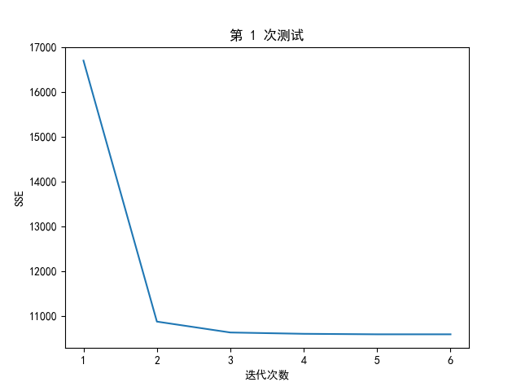
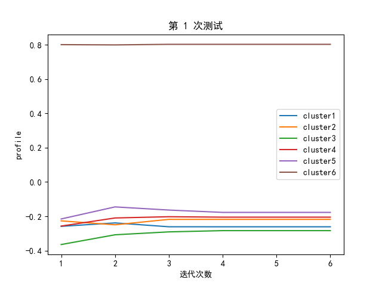
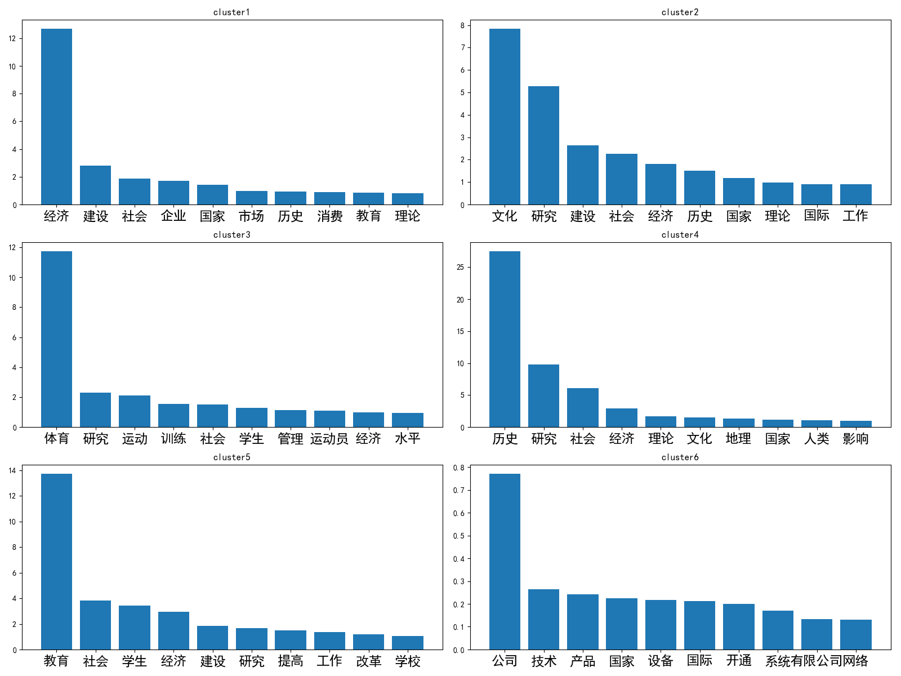
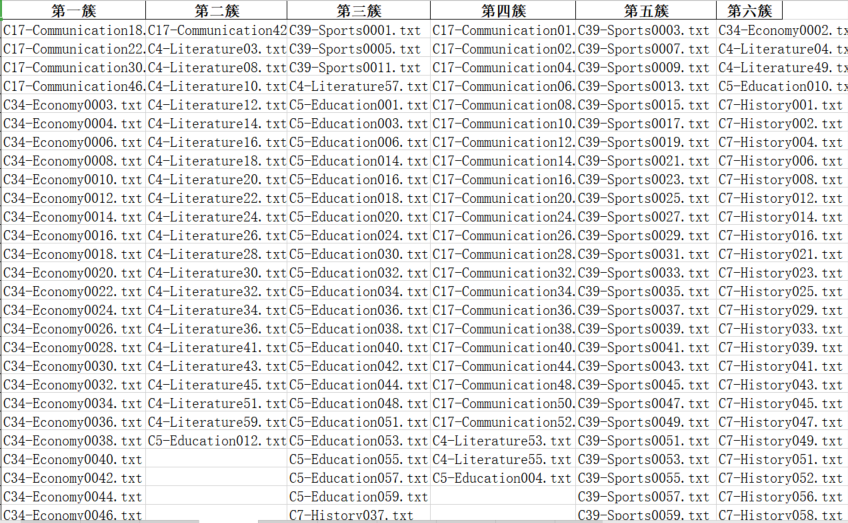

# 邮件分类（贝叶斯+SVM）

## topic.py

### Prerequisites

---

- Python3
- pandas
  - 用于保存结果到excel
- matplotlib
  - 用于绘图
- jieba
  - 中文分词库

### Getting Start

---

- 参数解释：

```
usage: topic.py [-h] [--train_path TRAIN_PATH] [--test_path TEST_PATH] [--K K] [--iter ITER] [--threshold THRESHOLD] [--times TIMES]
optional arguments:                                                                     -h, --help            show this help message and exit
  --train_path TRAIN_PATH    训练数据集，内含多个子文件夹，默认train30
  --test_path TEST_PATH    测试数据集，内含多个文件，默认test
  --K K                 K值，默认6
  --iter ITER           最大迭代次数，默认100
  --threshold THRESHOLD    停止条件，默认0.0005
  --times TIMES         测试次数，默认1
```

- 使用方法为：

```
python topic.py --times 10
```

- 结果：

你可以看到每次测试后的SSE、轮廓系数和每一簇中TF-IDF值最高的关键词，如下所示：







而在excel中，你可以看到这样的结果：



注意的是，你放入的文件需要以用诸如上面图片中的文件的命名格式来命名，即类别-xxxxx.txt，包括测试的文件也是的。

具体可以参考放入的train30和test两个文件夹
